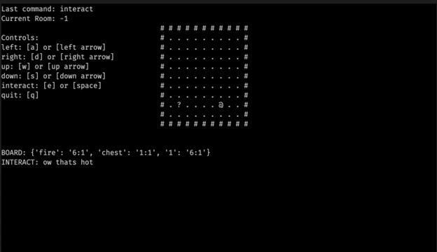
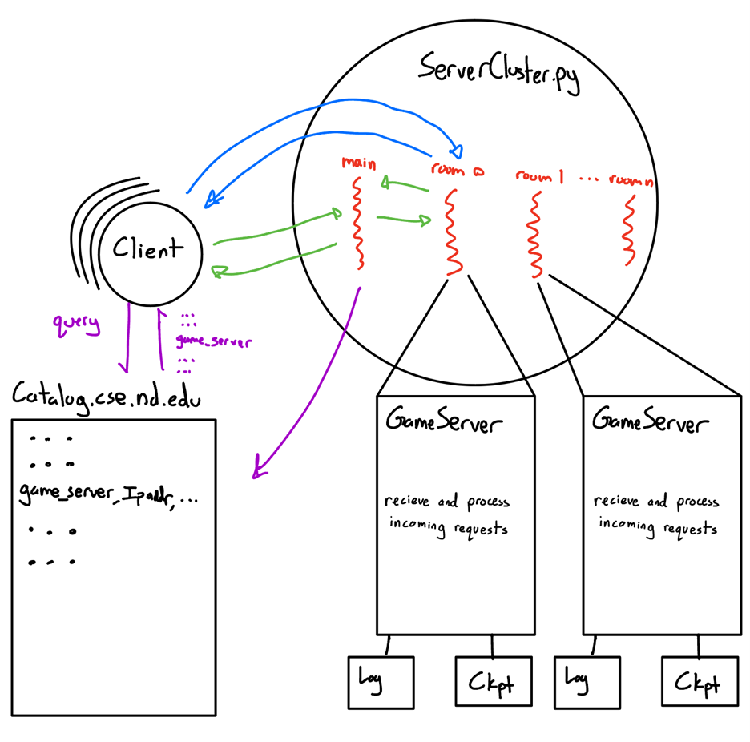
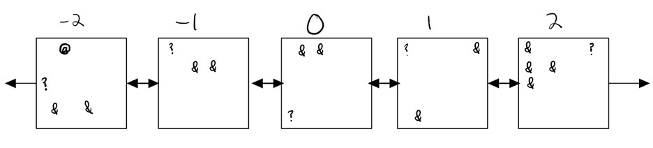
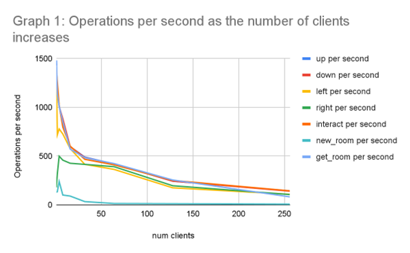
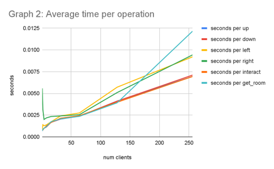
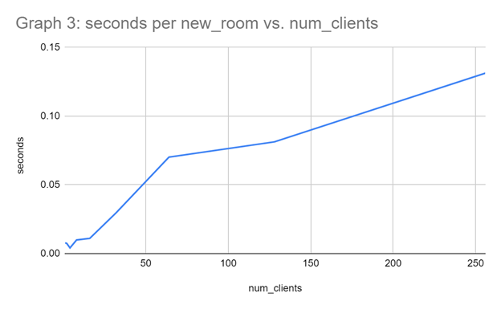
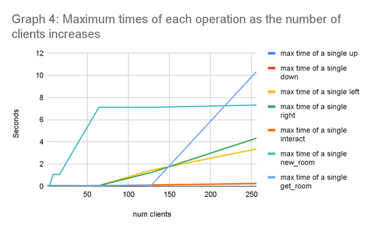

# Multiplayer Game Server

This project was created by [Blake Caven](https://github.com/BCaven), [James Lindell](https://github.com/jlindel2), and [Justin Yatsuhashi]()

## Clients

The Client GUI was built with [curses](https://docs.python.org/3/library/curses.html)

## Server Architecture

Python Server that creates individual room servers when requested. Each client first connects to the central server which then creates the requested room if necessary and sends the client to that new server.

The rooms were laid out in the following way so clients could walk from one room to the next.

## Performance

All data is available in [the data folder](data/perf_test_256.csv)

The server cluster is capable of handling an arbitrary number of clients thanks to the [poll](https://docs.python.org/3/library/select.html#select.poll) system call.

The throughput of the server increased as the number of clients increased before leveling off.

Since starting a new room potentially meant starting a new server, it is recorded in its own graph:

We chose to build in a timeout function for requests so in particularly high-latency scenarios, clients would simply retry a request instead of waiting for an unknown amount of time. This cutoff was 10 seconds when gathering this data.

## old links

[project proposal](https://docs.google.com/document/d/1E5WVPOji0Xnoev9RfgTY_eKf4BQtZS4C1mE3uBWUKTQ/edit?usp=sharing)

[progress report](https://docs.google.com/document/d/1zIZBFfcrm0L5ES2_26LUa1-h9lFnXMTDcizz6y1sDII/edit?usp=sharing)

[final report](https://docs.google.com/document/d/1I9jZRjalNO0yzPjt2KsoXdR8HRY-qYfRUXKZmn8qUKo/edit?usp=sharing)
